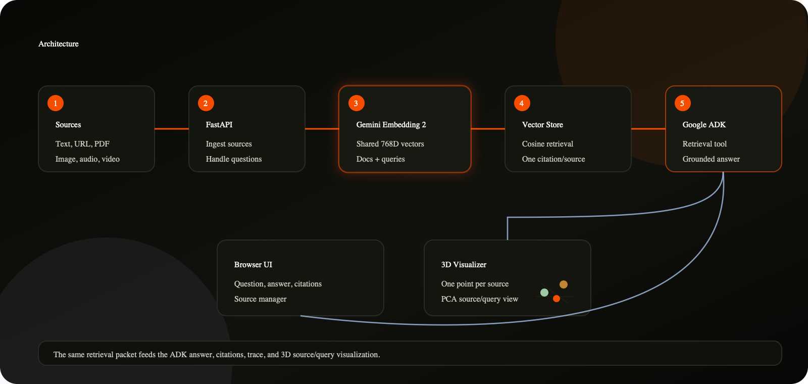

# Multimodal Agentic RAG

This is a multimodal RAG app built with Gemini Embedding 2 and Google ADK. Add text, URLs, PDFs, images, audio, or video; ask a question; and get a grounded answer with clear citations.

The UI includes a 3D embedding view for inspecting the search space. Each source appears as one point. When you ask a question, the query is projected into the same space and the cited sources are highlighted.



## What It Does

- Adds and removes multimodal sources from a local in-memory index.
- Uses Gemini Embedding 2 for source and query embeddings.
- Requires `GOOGLE_API_KEY`; the app does not use local vector or answer fallbacks.
- Retrieves evidence with cosine similarity over the stored embeddings.
- Runs a Google ADK agent to coordinate answer generation from the retrieved context.
- Shows citations separately from the answer text so citation IDs do not clutter the response.
- Projects source and query vectors into a 3D PCA view for inspection.

## Architecture

| Layer | Role |
| --- | --- |
| React + Vite frontend | Source manager, Q&A panel, citations, trace, and 3D embedding view |
| FastAPI backend | Ingestion, retrieval, answer API, and embedding-space snapshots |
| `MultimodalRagStore` | In-memory source metadata, chunks, embeddings, search, and PCA projection |
| Gemini Embedding 2 | Source and query embeddings across supported modalities |
| Google ADK agent | Answer coordinator that receives the same retrieval packet shown in the UI |

The important implementation detail is that `/ask` performs retrieval once and passes that same retrieval packet into the ADK answer flow. The answer and the citation panel are therefore based on the same ranked evidence.

## Project Structure

```text
rag_tutorials/multimodal_agentic_rag/
|-- README.md
|-- assets/
|   `-- multimodal-agentic-rag-architecture.png
|-- backend/
|   |-- app_state.py
|   |-- rag_store.py
|   |-- requirements.txt
|   |-- server.py
|   `-- agentic_rag_agent/
|       |-- __init__.py
|       `-- agent.py
`-- frontend/
    |-- index.html
    |-- package.json
    |-- src/
    |   |-- App.tsx
    |   |-- main.tsx
    |   `-- styles.css
    |-- tsconfig.json
    `-- vite.config.ts
```

## Run Locally

Start the backend:

```bash
cd rag_tutorials/multimodal_agentic_rag/backend
python3 -m venv .venv
source .venv/bin/activate
pip install -r requirements.txt
export GOOGLE_API_KEY="your-google-ai-studio-key"
python server.py
```

The backend runs at:

```text
http://localhost:8897
```

Start the frontend in another terminal:

```bash
cd rag_tutorials/multimodal_agentic_rag/frontend
npm install
npm run dev -- --port 5177
```

The frontend runs at:

```text
http://localhost:5177
```

If the backend is on a different port:

```bash
VITE_API_URL=http://localhost:8897 npm run dev -- --port 5177
```

## Try It

1. Open `http://localhost:5177`.
2. Add a text, URL, PDF, image, audio, or video source.
3. Ask a question in the Q&A panel.
4. Review the answer and citations.
5. Inspect the source and query points in the embedding view.

## API

| Method | Endpoint | Description |
| --- | --- | --- |
| `GET` | `/health` | Backend status, ADK availability, provider, dimensions, and source counts |
| `GET` | `/space` | Current sources, projected points, event trail, and projection metadata |
| `POST` | `/sources/text` | Add a text source |
| `POST` | `/sources/url` | Fetch and index a public URL |
| `POST` | `/sources/file` | Upload and index a PDF, image, audio, or video |
| `DELETE` | `/sources/{source_id}` | Remove a source and its chunks |
| `POST` | `/ask` | Retrieve evidence, run the ADK answer flow, and return citations |

## Notes

- Storage is in memory. Restarting the backend resets the demo index.
- URL ingestion blocks localhost and private IP ranges unless `ALLOW_PRIVATE_URLS=true` is set.
- Media files uploaded through the Gemini File API are cleaned up after embedding.
- Blocking media processing runs in a threadpool so the FastAPI event loop is not held.
- For production, replace the in-memory store with durable storage and add authentication, background ingestion, evals, observability, and a managed vector database.
